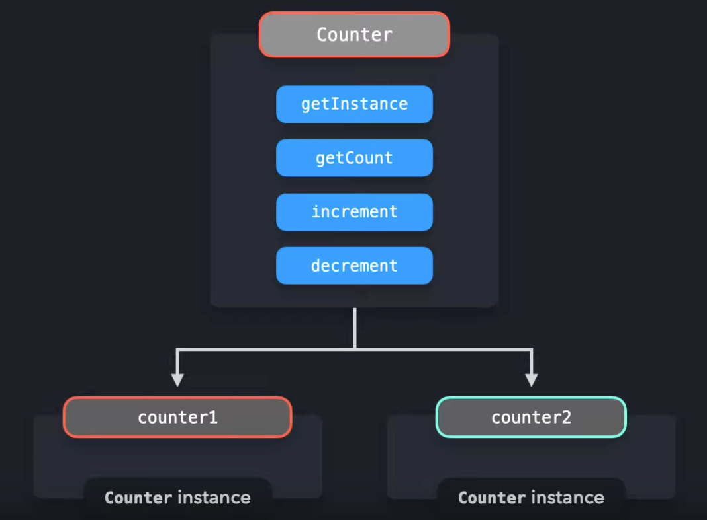

# Singleton Pattern

싱글톤은 한 번만 인스턴스화 될 수 있고, 전역적으로 접근할 수 있는 클래스 입니다. 이 단일 인스턴스는 애플리케이션 전체에서 공유될 수 있으며, 이는 싱글턴 애플리케이션의 전역 상태 관리에 적합하게 만듭니다.

ES2015 클래스를 사용하여 싱글턴이 어떤 모습일 수 있는지 살펴봅니다.

- 인스턴스의 값을 반환하는 `getInstance` 메서드
- 카운터의 값을 현재 값을 반환하는 `getCount`메서드
- 카운터 값을 하나 증가시키는 `increment` 메서드
- 카운터 값을 하나 감소시키는 `decrement` 메서드

```tsx
let counter = 0;

class Counter {
  getInstance() {
    return this;
  }

  getCount() {
    return counter;
  }

  increment() {
    return ++counter;
  }

  decrement() {
    return --counter;
  }
}
```

하지만 이 클래스는 싱글턴의 기준을 충족시키지 못합니다.

싱글턴은 한 번만 인스턴스화될 수 있어야 합니다.

현재, 우리는 Counter 클래스의 여러 인스턴스를 생성할 수 있습니다.

```tsx
const counter1 = new Counter();
const counter2 = new Counter();

console.log(counter1 === counter2); // true
```

`new` 메소드를 두 번 호출함으로써, `counter1` 과 `counter2`에 대해 `getInstance` 메서드가 반환하는 값들은 사실상 서로 다른 인스턴스에 대한 참조를 반환합니다.

`counter1` 과 `counter2` 는 엄밀히 동일하지 않습니다!



인스턴스가 단 하나만 생성될 수 있도록 보장하는 한 가지 방법은, 'instance' 라는 변수를 생성하는 것입니다.
Counter의 생성자에서, 새 인스턴스가 생성될 때 'instance'를 인스턴스에 대한 참조로 설정할 수 있습니다.
'instance' 변수에 이미 값이 있는지 확인함으로써 새로운 인스턴스 생성을 방지할 수 있습니다. 만약 값이 있다고 확인이 된다면 인스턴스가 이미 존재하는 것입니다. 이렇게 된다면, 사용자에게 알려주기 위한 오류가 발생해야 합니다.

```tsx
let instance;
let counter = 0;

class Counter {
  constructor() {
    if (instance) {
      throw new Error("You can only create one instance!");
    }
    instance = this;
  }

  getInstance() {
    return this;
  }

  getCount() {
    return counter;
  }

  increment() {
    return ++counter;
  }

  decrement() {
    return --counter;
  }
}

const counter1 = new Counter();
const counter2 = new Counter();
// Error: You can only create one instance!
```

완벽합니다! 더 이상 여러 인스턴스를 만들 수 없습니다.

`counter.js` 파일에서 Counter 인스턴스를 내보내기 전에, 인스턴스를 고정(freeze)하는 것도 중요합니다.
`Object.freeze` 메서드는 사용하는 코드가 싱글톤을 수정할 수 없도록 보장합니다. 고정된 인스턴스에는 속성을 추가하거나 수정할 수 없으며, 이는 싱글톤의 값이 우연히 덮어쓰여질 위험을 줄입니다.

```tsx
let instance;
let counter = 0;

class Counter {
  constructor() {
    if (instance) {
      throw new Error("You can only create one instance!");
    }
    instance = this;
  }

  getInstance() {
    return this;
  }

  getCount() {
    return counter;
  }

  increment() {
    return ++counter;
  }

  decrement() {
    return --counter;
  }
}

const singletonCounter = Object.freeze(new Counter());
export default singletonCounter;
```

Counter 예제를 구현한 애플리케이션을 살펴보겠습니다.

다음과 같은 파일들이 있습니다.

- counter.js: Counter 클래스를 포함하고, 기본으로 Counter 인스턴스를 내보냅니다.
- index.js: redButton.js 와 blueButton.js 모듈을 불러옵니다.
- redButton.js: Counter를 가져오고, 빨간 버튼에 Counter의 increment 메서드를 이벤트 리스너로 추가하며, getCount 메서드를 호출하여 현재 카운터의 값을 로그합니다.
- blueButton.js: Counter를 가져오고, 파란 버튼에 Counter의 increment 메서드를 이벤트 리스너로 추가하며, getCount 메서드를 호출하여 현재 카운터의 값을 로그합니다.

```tsx
import "./redButton";
import "./blueButton";

console.log("Click on either of the buttons 🚀!");
```

```tsx
let instance;
let counter = 0;

class Counter {
  constructor() {
    if (instance) {
      throw new Error("You can only create one instance!");
    }
    instance = this;
  }

  getInstance() {
    return this;
  }

  getCount() {
    return counter;
  }

  increment() {
    return ++counter;
  }

  decrement() {
    return --counter;
  }
}

const singletonCounter = Object.freeze(new Counter());
export default singletonCounter;
```

```tsx
import Counter from "./counter";

const button = document.getElementById("red");
button.addEventListener("click", () => {
  Counter.increment();
  console.log("Counter total: ", Counter.getCount());
});
```

```tsx
import Counter from "./counter";

const button = document.getElementById("blue");
button.addEventListener("click", () => {
  Counter.increment();
  console.log("Counter total: ", Counter.getCount());
});
```

blueButton.js와 redButton.js 모두 counter.js에서 같은 인스턴스를 가져옵니다. 이 인스턴스는 두 파일 모두에서 Counter로 가져옵니다.

redButton.js나 blueButton.js에서 increment 메서드를 호출하면, Counter 인스턴스의 카운터 속성 값이 두 파일에서 모두 업데이트됩니다. 빨간 버튼이나 파란 버튼을 클릭하든 상관없이, 모든 인스턴스 간에 같은 값이 공유됩니다. 이것이 우리가 서로 다른 파일에서 메서드를 호출하더라도 카운터가 하나씩 계속 증가하는 이유입니다.

## Tradeoff

인스턴스화를 단 하나의 인스턴스로 제한하는 것은 잠재적으로 많은 메모리 공간을 절약할 수 있습니다. 매번 새 인스턴스에 대한 메모리를 설정하는 대신, 우리는 애플리케이션 전체에서 참조되는 그 하나의 인스턴스에 대해서만 메모리를 설정해야 합니다. 그러나, 싱글톤은 실제로 안티 패턴으로 간주되며, 자바스크립트에서는 (또는.. 해야만 한다면) 피해야 합니다.

많은 프로그래밍 언어들, 예를 들어 자바나 C++에서는 자바스크립트에서와 같은 방식으로 직접 객체를 생성할 수 없습니다. 이러한 객체 지향 프로그래밍 언어에서는 클래스를 생성해야 하며, 이 클래스는 객체를 생성합니다. 생성된 객체는 클래스의 인스턴스 값과 마찬가지로, 자바스크립트 예제의 인스턴스 값과 같은 값을 갖습니다.

하지만, 위의 예제에서 보여준 클래스 구현은 실제로 과한 면이 있습니다.

자바스크립트에서는 직접 객체를 생성할 수 있으므로, 우리는 정확히 같은 결과를 달성하기 위해 단순한 일반 객체를 사용할 수 있습니다.

싱글톤 사용의 단점을 몇 가지 살펴봅시다!

## Using a regular object

이전에 본 같은 예제를 사용해 봅시다. 하지만 이번에는 카운터가 단순히 다음을 포함하는 객체입니다:

- count 속성
- count 값을 하나 증가시키는 increment 메서드
- count 값을 하나 감소시키는 decrement 메서드

```tsx
let count = 0;

const counter = {
  increment() {
    return ++count;
  },
  decrement() {
    return --count;
  },
};

Object.freeze(counter);
export { counter };
```

객체는 참조에 의해 전달되기 때문에, redButton.js와 blueButton.js 모두 같은 카운터 객체에 대한 참조를 가져오고 있습니다. 이 두 파일 중 어느 하나에서 count의 값을 수정하면 카운터의 값이 변경되며, 이 변경사항은 두 파일 모두에서 확인할 수 있습니다.

## Test

싱글톤에 의존하는 코드를 테스트 하는 것은 까다로울 수 있습니다.

매번 새로운 인스턴스를 생성할 수 없기 때문에, 모든 테스트는 이전 테스트의 전역 인스턴스 변경에 의존하게 됩니다.

이 경우 테스트의 순서가 중요하며, 작은 수정 하나로 전체 테스트가 실패할 수 있습니다.

테스트 후에는 테스트에 의해 이루어진 변경 사항을 초기화하기 위해 전체 인스턴스를 리셋해야 합니다.

## Dependency hiding

다른 모듈을 가져올 때, 이 경우에는 superCounter.js를 예로 들면, 해당 모듈이 싱글톤을 가져오고 있다는 사실이 명확하지 않을 수 있습니다.

예를 들어, superCounter.js라는 모듈이 싱글톤 패턴을 사용하여 Counter 인스턴스를 만들고 관리한다고 가정해 보겠습니다. 이 모듈은 싱글톤 인스턴스를 내보내고, 다른 파일(예: index.js)에서 이 모듈을 가져와 메서드를 호출합니다. index.js나 다른 모듈에서 superCounter.js를 사용할 때, 이들은 자신들이 싱글톤 인스턴스를 다루고 있다는 사실을 명확히 인지하지 못할 수 있습니다.

이로 인해 index.js와 같은 외부 파일에서 superCounter.js의 메서드를 호출할 때 싱글톤 인스턴스의 상태를 변경하게 되고, 이 변경은 애플리케이션 전체에 걸쳐 반영됩니다. 만약 여러 개의 모듈이 이 싱글톤 인스턴스를 사용하고 있다면, 한 모듈에서의 변경이 모든 모듈에 영향을 미치게 되므로, 예상치 못한 동작이나 버그가 발생할 위험이 있습니다.

따라서, 모듈을 사용하는 개발자는 모듈이 내부적으로 싱글톤 인스턴스를 사용하고 있다는 사실을 명확히 알고 있어야 하며, 이에 따라 모듈을 올바르게 사용할 수 있어야 합니다.

```tsx
// superCounter.js
import Counter from "./counter";

export default class SuperCounter {
  constructor() {
    this.count = 0;
  }

  increment() {
    Counter.increment();
    return (this.count += 100);
  }

  decrement() {
    Counter.decrement();
    return (this.count -= 100);
  }
}
```

```tsx
//test.js
import Counter from "../src/counterTest";

test("incrementing 1 time should be 1", () => {
  Counter.increment();
  expect(Counter.getCount()).toBe(1);
});

test("incrementing 3 extra times should be 4", () => {
  Counter.increment();
  Counter.increment();
  Counter.increment();
  expect(Counter.getCount()).toBe(4);
});

test("decrementing 1  times should be 3", () => {
  Counter.decrement();
  expect(Counter.getCount()).toBe(3);
});
```

## 전역 동작

싱글톤 인스턴스는 전체 앱에서 참조될 수 있어야 합니다.

전역 변수는 본질적으로 동일한 동작을 보입니다.

전역 변수는 전역 스코프에서 사용할 수 있으므로, 애플리케이션 전체에서 이러한 변수에 접근할 수 있습니다.

전역 변수를 가지는 것은 일반적으로 나쁜 설계로 여겨집니다. 전역 범위를 오염시키는 것은 실수로 전역 변수의 값을 덮어쓰게 되어 많은 사이드 이펙트를 초래할 수 있습니다.

ES2015에선, 전역 변수를 생성하는 것은 상당히 드뭅니다. 새로운 `let`, `const` 키워드는 변수들을 블록 스코프 범위로 유지함으로써 개발자들이 실수로 전역 범위를 오염시키는 것을 방지합니다.

자바스크립트의 새 모듈 시스템은 전역 범위를 오염시키지 않고도 모듈에서 값을 내보내고 다른 파일에서 그 값을 가져올 수 있게 함으로써, 전역적으로 접근 가능한 값을 만드는 것을 더 쉽게 해줍니다.

그러나, 싱글톤의 일반적인 사용 사례는 애플리케이션 전체에 걸쳐 어떤 종류의 전역 상태를 가지는 것입니다. 코드베이스의 여러 부분이 같은 가변 객체에 의존하는 것은 예상치 못한 동작을 초래할 수 있습니다.

보통 코드베이스의 특정 부분에서는 전역 상태 내의 값을 변경하고, 다른 부분에서는 그 데이터를 사용합니다. 여기서 실행 순서가 중요해요: 아직 데이터가 없는데 미리 데이터를 사용하고 싶지는 않죠! 전역 상태를 사용할 때 데이터 흐름을 이해하는 것은 애플리케이션이 커지고 수십 개의 컴포넌트가 서로 의존하게 되면 복잡해질 수 있습니다.
